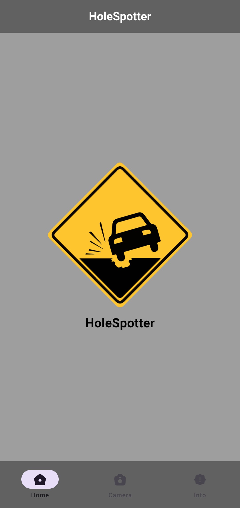
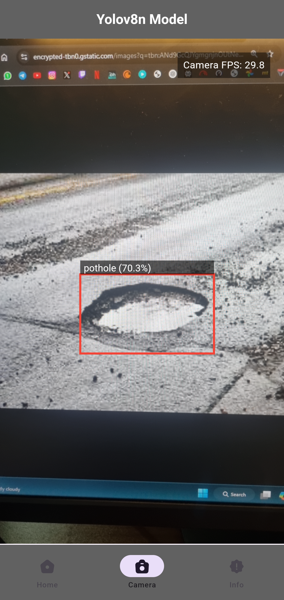
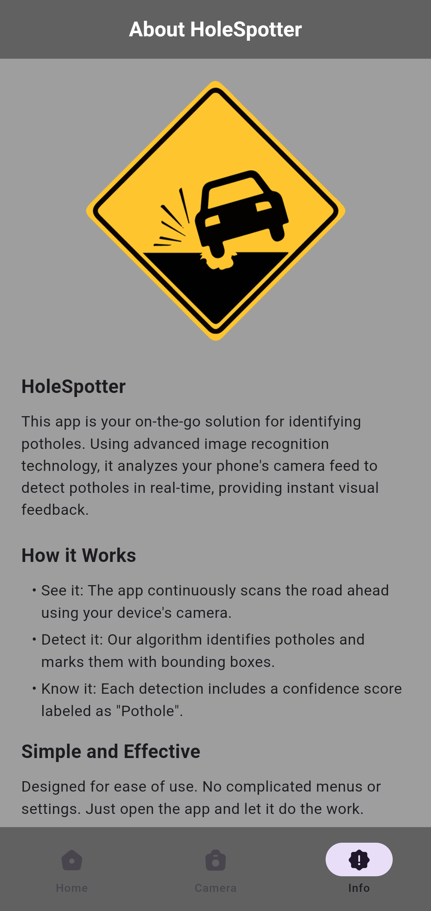

# 🕳️ HoleSpotter-YOLOv8n  
**HoleSpotter: A real-time pothole detection system using YOLOv8 and Flutter for mobile deployment.**  

## 🌍 Overview  
HoleSpotter leverages deep learning to detect potholes in real-time. This project combines the power of **YOLOv8n** with a sleek **Flutter mobile app**, designed to enhance **road safety** by quickly identifying potholes.  

## ✨ Features  
- 🚗 **Real-Time Detection:** Instantly detects potholes using live video feeds.  
- 🧠 **YOLOv8n-Powered:** Utilizes the **YOLOv8 model** for high-speed, high-accuracy detection.  
- 📱 **User-Friendly Interface:** Simple, intuitive design for viewing detection results.  

## 📸 UI Preview  
Here’s a quick look at the app interface:  

  
  
  

  
